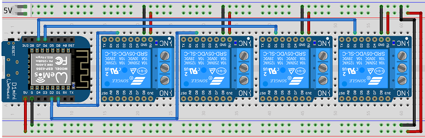

# bSwitches Library
## Overview
A bSwitch allows you to easily manage physical switches like relays.
## Features
- **Inching mode** - A bSwitch can be easily configured to be automatically turned off after a timeout.
- **Inching lock** - A locked bSwitch cannot be turned off until the inching timeout is expired.
- **Interlock mode** - Two or more interlocked bSwitches cannot be turned on simultaneously. When one switch is turned on, all the others are forcibly turned off. Only one single interlocked bSwitch can be turned on at a time. 
- **Verbose state** - Optionally, you can configure verbose state instead of default booleans (e.g: 'ON'/'OFF'). This feature is inherited form [bBinarySensors](https://github.com/diy365-mgos/bbinsens#features).
## GET STARTED
Copy, build and flash one of the following ready-to-use firmwares.
#### Example 1 - 4 relays array
Createa 4 relays array having following configuration:
- Relay #1: standard mode
- Relay #2: inching mode
- Relay #3 and #4: interlock mode

Before running the code sample, you must wire your boardas indicated in the schema below.


Include these libraries in your mos.yml file.
```yaml
libs:
  - origin: https://github.com/diy365-mgos/bswitch
  - origin: https://github.com/diy365-mgos/bthing-gpio
```
```c
#include "mgos.h"
#include "mgos_bswitch.h"
#include "mgos_bthing_gpio.h"

static int gpio_pin1 = 5;   //Wemos D1
static int gpio_pin2 = 4;   //Wemos D2
static int gpio_pin3 = 12;  //Wemos D7
static int gpio_pin4 = 13;  //Wemos D6

static void switch_state_changed_cb(int ev, void *ev_data, void *userdata) {
  struct mgos_bthing_state *arg = (struct mgos_bthing_state *)ev_data;

  LOG(LL_INFO, ("The '%s' has been switched %s",
    mgos_bthing_get_uid(arg->thing), mgos_bvar_get_str(arg->state)));
}

void toggle_switch1_cb(void *param) {
  mgos_bbactuator_toggle_state(MGOS_BSWITCH_DOWNCAST((mgos_bswitch_t)param));
}

void turn_switch2_on_cb(void *param) {
  mgos_bbactuator_set_state(MGOS_BSWITCH_DOWNCAST((mgos_bswitch_t)param), true);
}

void toggle_switch_grp_cb(void *param) {
  bool state;
  mgos_bswitch_t sw = (mgos_bswitch_t)mgos_bthing_get_by_uid("switch3");
  mgos_bbinsens_get_state(MGOS_BSWITCH_SENSCAST(sw), &state);
  if (state) sw = (mgos_bswitch_t)mgos_bthing_get_by_uid("switch4");
  mgos_bbactuator_set_state(MGOS_BSWITCH_DOWNCAST(sw), true);
  (void) param;
}

enum mgos_app_init_result mgos_app_init(void) {
  mgos_event_add_handler(MGOS_EV_BTHING_STATE_CHANGED, switch_state_changed_cb, NULL);

  // create the switch #1 - standard mode
  mgos_bswitch_t sw1 = mgos_bswitch_create("switch1", MGOS_BSWITCH_NO_GROUP, MGOS_BSWITCH_DEFAULT_SWITCHING_TIME, "relays");
  mgos_bbinsens_set_verbose_state(MGOS_BSWITCH_SENSCAST(sw1), "ON", "OFF");
  mgos_bthing_gpio_attach(MGOS_BSWITCH_THINGCAST(sw1), gpio_pin1, true, MGOS_GPIO_PULL_UP);
  // simulate an external trigger for toggling 'switch1' state
  mgos_set_timer(10000, MGOS_TIMER_REPEAT, toggle_switch1_cb, sw1);

  // create the switch #2 - inching mode
  mgos_bswitch_t sw2 = mgos_bswitch_create("switch2", MGOS_BSWITCH_NO_GROUP, MGOS_BSWITCH_DEFAULT_SWITCHING_TIME, "relays");
  mgos_bbinsens_set_verbose_state(MGOS_BSWITCH_SENSCAST(sw2), "ON", "OFF");
  mgos_bthing_gpio_attach(MGOS_BSWITCH_THINGCAST(sw2), gpio_pin2, true, MGOS_GPIO_PULL_UP);
  mgos_bswitch_set_inching(sw2, 1000, true);
  // simulate an external trigger for turning ON the 'switch2' 
  mgos_set_timer(3000, MGOS_TIMER_REPEAT, turn_switch2_on_cb, sw2);

  // create the switch #3 - interlock monde (group 1)
  mgos_bswitch_t sw3 = mgos_bswitch_create("switch3", 1, MGOS_BSWITCH_DEFAULT_SWITCHING_TIME, "relays");
  mgos_bbinsens_set_verbose_state(MGOS_BSWITCH_SENSCAST(sw3), "ON", "OFF");
  mgos_bthing_gpio_attach(MGOS_BSWITCH_THINGCAST(sw3), gpio_pin3, true, MGOS_GPIO_PULL_UP);
  // create the switch #4 - interlock monde (group 1)
  mgos_bswitch_t sw4 = mgos_bswitch_create("switch4", 1, MGOS_BSWITCH_DEFAULT_SWITCHING_TIME, "relays");
  mgos_bbinsens_set_verbose_state(MGOS_BSWITCH_SENSCAST(sw4), "ON", "OFF");
  mgos_bthing_gpio_attach(MGOS_BSWITCH_THINGCAST(sw4), gpio_pin4, true, MGOS_GPIO_PULL_UP);
  // simulate an external trigger for toggling 'switch3' and 'switch4'
  mgos_set_timer(10000, MGOS_TIMER_REPEAT, toggle_switch_grp_cb, NULL);

  return MGOS_APP_INIT_SUCCESS;
}
```
## Inherited APIs
A bSwitch inherits inherits APIs from:
- [bThing](https://github.com/diy365-mgos/bthing)
- [bBinarySensor](https://github.com/diy365-mgos/bbinsens)
- [bBinaryActuator](https://github.com/diy365-mgos/bbactuator)
### Remarks on: mgos_bthing_on_get_state()
The [get-state handler](https://github.com/diy365-mgos/bthing#mgos_bthing_get_state_handler_t) must set `true` (ON) or `false` (OFF) the `state` parameter.
```c
static bool my_get_state_handler(mgos_bthing_t thing, mgos_bvar_t state, void *userdata) {
  bool sw_state;
  // sw_state = ... get the physical switch state (true or false)
  mgos_bvar_set_bool(state, sw_state);
  return true;
}
mgos_bswitch_t sw = mgos_bswitch_create(...);
mgos_bthing_on_get_state(MGOS_BSWITCH_THINGCAST(sw), my_get_state_handler, NULL);
```
### Remarks on: mgos_bthing_get_state()
The [mgos_bthing_get_state()](https://github.com/diy365-mgos/bthing#mgos_bthing_get_state) returns a boolean value or a string value in case [verbose state](https://github.com/diy365-mgos/bbinsens#mgos_bbinsens_set_verbose_state) is configured. Alternatively you can use the [mgos_bbinsens_get_state()](https://github.com/diy365-mgos/bbinsens#mgos_bbinsens_get_state) helper function.
```c
// standard (bool) state
mgos_bswitch_t sw = mgos_bswitch_create(...);
mgos_bvarc_t state = mgos_bthing_get_state(MGOS_BSWITCH_THINGCAST(sw));
bool sw_state = mgos_bvar_get_bool(state);

// verbose state
mgos_bswitch_t sw = mgos_bswitch_create(...);
mgos_bbinsens_set_verbose_state(MGOS_BSWITCH_SENSCAST(sw), "ON", "OFF");
mgos_bvarc_t state = mgos_bthing_get_state(MGOS_BBACTUATOR_THINGCAST(sw));
const char *sw_state = mgos_bvar_get_str(state);
```
### Remarks on: mgos_bthing_on_set_state()
The `state` parameter value in the [set-state handler](https://github.com/diy365-mgos/bthing#mgos_bthing_set_state_handler_t) is a boolean value.
```c
static bool my_set_state_handler(mgos_bthing_t thing, mgos_bvarc_t state, void *userdata) {
  bool state_to_set = mgos_bvar_get_bool(state);
  // set switch state...  
  return true;
}
mgos_bswitch_t sw = mgos_bswitch_create(...);
mgos_bthing_on_set_state(MGOS_BSWITCH_THINGCAST(sw), my_set_state_handler, NULL);
```
### Remarks on: mgos_bthing_set_state()
The [mgos_bthing_set_state()](https://github.com/diy365-mgos/bthing#mgos_bthing_set_state) allows boolean values as input parameter. In case [verbose state](https://github.com/diy365-mgos/bbinsens#mgos_bbinsens_set_verbose_state) is configured, string values are allowed instead. Alternatively you can use [mgos_bbactuator_set_state()](https://github.com/diy365-mgos/bbactuator#mgos_bbactuator_set_state) or [mgos_bbactuator_toggle_state](https://github.com/diy365-mgos/bbactuator#mgos_bbactuator_toggle_state) helper functions.
```c
// standard (bool) state
mgos_bswitch_t sw = mgos_bswitch_create(...);
mgos_bvar_t state = mgos_bvar_new_bool(true);
mgos_bthing_set_state(MGOS_BSWITCH_THINGCAST(sw), MGOS_BVAR_CONST(state));
mgos_bvar_free(state);

// verbose state
mgos_bswitch_t sw = mgos_bswitch_create(...);
mgos_bbinsens_set_verbose_state(MGOS_BSWITCH_SENSCAST(sw), "ON", "OFF");
mgos_bvar_t state = mgos_bvar_new_str("ON");
mgos_bthing_set_state(MGOS_BSWITCH_THINGCAST(sw), MGOS_BVAR_CONST(state));
mgos_bvar_free(state);
```
## C/C++ APIs Reference
### MGOS_BSWITCH_TYPE
```c
#define MGOS_BSWITCH_TYPE
```
The bSwitch type ID. It can be used with [mgos_bthing_is_typeof()](https://github.com/diy365-mgos/bthing#mgos_bthing_is_typeof).

Example:
```c
mgos_bactuator_t sw = mgos_bswitch_create(...);
if (mgos_bthing_is_typeof(MGOS_BACTUATOR_THINGCAST(sw), MGOS_BSWITCH_TYPE))
  LOG(LL_INFO, ("I'm a bSwitch."));
if (mgos_bthing_is_typeof(MGOS_BACTUATOR_THINGCAST(sw), MGOS_BBACTUATOR_TYPE))
  LOG(LL_INFO, ("I'm a bBinaryActuator."));
if (mgos_bthing_is_typeof(MGOS_BACTUATOR_THINGCAST(sw), MGOS_BACTUATOR_TYPE))
  LOG(LL_INFO, ("I'm a bActuator."));
if (mgos_bthing_is_typeof(MGOS_BACTUATOR_THINGCAST(sw), MGOS_BTHING_TYPE_ACTUATOR))
  LOG(LL_INFO, ("I'm a bThing actuator."));
if (mgos_bthing_is_typeof(MGOS_BACTUATOR_THINGCAST(sw), MGOS_BBINSENS_TYPE))
  LOG(LL_INFO, ("I'm a bBinarySensor."));
if (mgos_bthing_is_typeof(MGOS_BACTUATOR_THINGCAST(sw), MGOS_BSENSOR_TYPE))
  LOG(LL_INFO, ("I'm a bSensor."));
if (mgos_bthing_is_typeof(MGOS_BACTUATOR_THINGCAST(sw), MGOS_BTHING_TYPE_SENSOR))
  LOG(LL_INFO, ("I'm a bThing sensor."));
```
Output console:
```bash
I'm a bSwitch.
I'm a bBinaryActuator.
I'm a bActuator.
I'm a bThing actuator.
I'm a bBinarySensor.
I'm a bSensor.
I'm a bThing sensor.
```
### MGOS_BSWITCH_THINGCAST
```c
mgos_bthing_t MGOS_BSWITCH_THINGCAST(mgos_bswitch_t sw);
```
Casts a bSwitch to a generic bThing to be used with [inherited bThing APIs](https://github.com/diy365-mgos/bthing).

|Parameter||
|--|--|
|sw|A bSwitch.|

Example:
```c
mgos_bswitch_t sw = mgos_bswitch_create(...);
LOG(LL_INFO, ("%s successfully created.", mgos_bthing_get_uid(MGOS_BSWITCH_THINGCAST(sw))));
```
### MGOS_BSWITCH_SENSCAST
```c
mgos_bbinsens_t MGOS_BSWITCH_SENSCAST(mgos_bswitch_t sw);
```
Casts a bSwitch to a bBinarySensor to be used with [inherited bBinarySensor APIs](https://github.com/diy365-mgos/bbinsens).

|Parameter||
|--|--|
|sw|A bSwitch.|

Example:
```c
mgos_bswitch_t sw = mgos_bswitch_create(...);
bool state;
if (mgos_bbinsens_get_state(MGOS_BSWITCH_SENSCAST(sw), &state))
  LOG(LL_INFO, ("The state is %s.", (state ? "TRUE" : "FALSE")));
```
### MGOS_BSWITCH_DOWNCAST
```c
mgos_bbactuator_t MGOS_BSWITCH_DOWNCAST(mgos_bswitch_t sw);
```
Casts a bSwitch to a bBinaryActuator to be used with [inherited bBinaryActuator APIs](https://github.com/diy365-mgos/bbactuator).

|Parameter||
|--|--|
|sw|A bSwitch.|

Example:
```c
mgos_bswitch_t sw = mgos_bswitch_create(...);
mgos_bbactuator_toggle_state(MGOS_BSWITCH_DOWNCAST(sw)));
```
### mgos_bswitch_create
```c
mgos_bswitch_t mgos_bswitch_create(const char *id, int group_id, int switching_time, const char *domain);
```
Creates a bSwitch. Returns `NULL` on error.

|Parameter||
|--|--|
|id|The bSwitch ID.|
|group_id|The group to which the bSwitch belongs. Switches in the same group run in interlock mode. Set to `MGOS_BSWITCH_NO_GROUP` to disable gouping and interlock mode.|
|switching_time|The time, in milliseconds, the physical switch soldered on the circuit board (e.g: a relay) may require to change its state. Set to `MGOS_BSWITCH_DEFAULT_SWITCHING_TIME` to use the default 10ms timeout ot set to `0` to disable it.|
|domain|The domain name or `NULL`.|
### mgos_bswitch_set_inching
```c
bool mgos_bswitch_set_inching(mgos_bswitch_t sw, int timeout, bool lock);
```
Sets the inching mode of a bSwitch. Returns `true` on success, or `false` otherwise.

|Parameter||
|--|--|
|sw|A bSwitch.|
|timeout|The inching timeout, in milliseconds. Set to `MGOS_BSWITCH_NO_INCHING` to disable inching mode.|
|lock|If `true`, this flag prevents a switch to be turned OFF before its inching timeout. Set to `false` to disable the lock. Ignored if `timeout` is `MGOS_BSWITCH_NO_INCHING`.|
## To Do
- Implement javascript APIs for [Mongoose OS MJS](https://github.com/mongoose-os-libs/mjs).